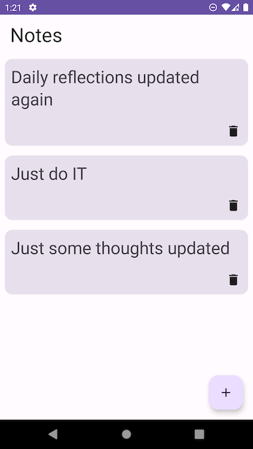
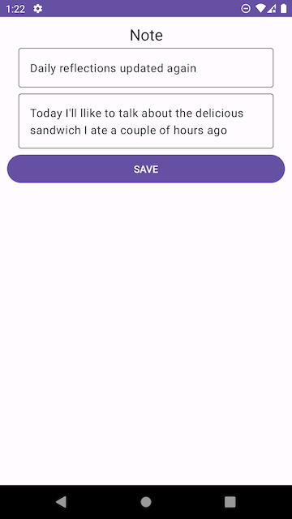
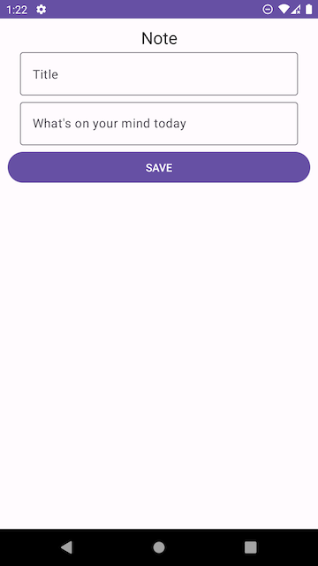

# NotesApp

This project aims to learn the new Android components by Google such as
Jetpack compose, ViewModels, Kotlin Coroutines, Asynchronous Flow.

The scope for the UI will be reduced wherever possible to save time and
the focus area will be clean architecture following Modern App Architecture.

## Functionality
- [x] Show a list of notes fetched from the database
- [x] Show note details
- [x] Edit existing note
- [x] Delete note
- [ ] Search
- [ ] Add note as favourite
- [ ] Sort notes by created date, title
- [ ] Empty state and loading state
- [ ] Offline availability

### Refactors & Notes

- [ ] Refactor all harcoded strings
- [ ] Use dependency injection with Hilt
- [x] Start adding some tests

| List | Details | Add New |
| --- | --- | --- |
||||